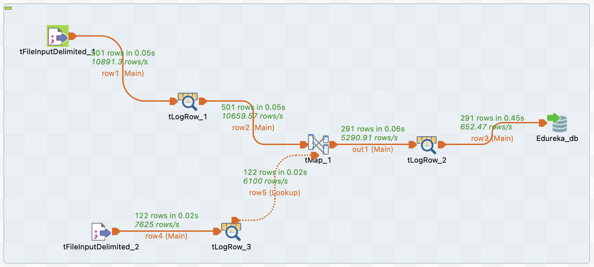

# Case Study Module 2: Upgrade a salary tally software and perform a Survey

### Problem 1:

Suppose an organization pays their employees on a monthly basis. The salary of each of its employees is tallied in an XML file for each month. But now the management wants to upgrade their salary tally software. According to the new requirements, the new software must perform following things:

a. If an employee is not present during a month award them zero salaries.

b. If a particular month is not present in the salary XML file, award zero salaries for that as well.

c. Extract the salaries of each employee for the year 2015 and 2016 in two separate Excel files.

Now, using Talend Open Studio for DI, generate a solution for it.

**DATA SET FILES:** EmployeeSalary.xml

### Solution 1:

1. created Metadata

  

2. add component "tFileInputXML" and "tLogRow"

  

3. here is the repository

  

  

4. run and get output

  

5. extract salary for 2015 & 2016 with "tMap"

  

  

  

### Problem 2:

Suppose your company wants to perform a survey on its clients from different parts of the world. For that each employee receives a data set containing the client information from a different country. You received the data set of State of California with the following structure:
- First name
- Last name
- Address
- City

Now, you need to perform the following operations on the provided data set:
- Most of the sales of your company comes from two countries of California, Orange and Los Angeles. Thus, you have to extract the data of the clients residing only in these two countries and then load it into the database.
- The data which you will load into the database should have the following structure:

  - Key (key, Type: Integer)
  - Name (Type: String, max. length: 40)
  - Address (Type: String, max.length: 40) 
  - Country (Type: String, max. length:40)

Where ‘Key’ is a numeric primary key in the database and ‘Name’ is the complete name.

- Make sure you use a secure connection i.e connect to a database, transfer the files and then close the connection, once the job is done.

**DATA SET FILES:** SampleFile.csv, LosAngelesandOrangeCounties.csv

### Solution 2:

1. create table schema

```mysql
  create table LosAngelesandOrangeCounties
  (
      `Key` int auto_increment,
      Name varchar(40) null,
      Address varchar(40) null,
      Country varchar(40) null,
      constraint LosAngelesandOrangeCounties_pk
          primary key (`Key`)
  );
```

2. create job with below components:



3. `tMap` need to join 2 datasets


4. run the job and review the result in database table:


### Problem 3:
Consider you are a Talend trainer, and you have to train a new team on creating workflows, working with various source files and connecting to the database and store data into it. Now being a trainer, demonstrate how to perform following:

- Load a CSV file into Talend to perform mapping operations and upload the modified data into a new CSV file.
- Load JSON file into Talend to perform mapping and check how it works. Then write the mapped data into new JSON file
- Connect to a database and upload the given files into it, map it and write the results back into a new table.

**DATA SETS FILES:** Sample.csv, Sample.json

### Solution 3:

_this page is under construction..._

_to be continued..._ 

