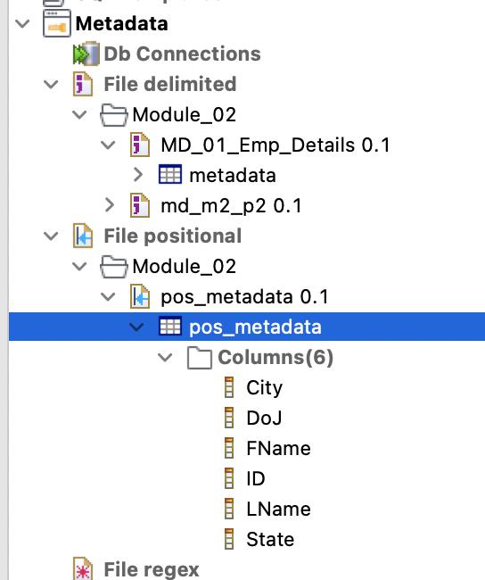
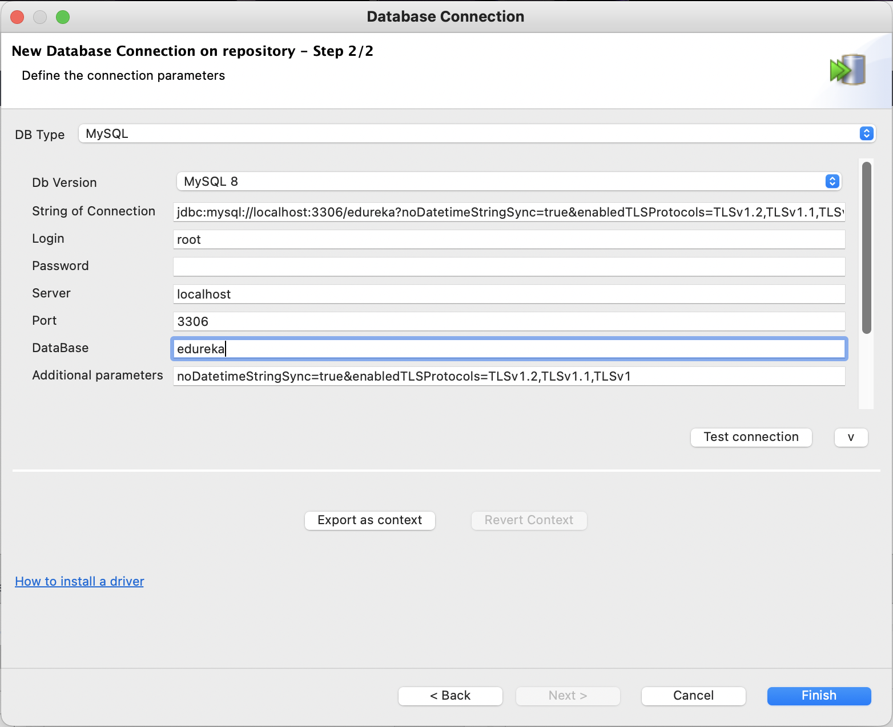

# Module 2: Working With Talend Open Studio DI

## Practical Document

### B. Adding Components In A Job

**STEPS:**

1. Create a new job and provide a relevant name.
2. Specify the purpose of creating the job
3. Provide the necessary information about the job.

   img
4. Select the path, where you want to store your job.
5. Click on ‘Finish’.
6. From the palette drag the components you need for the job and drop them into the workspace.

### C. Connecting The Components

**STEPS:**

### D. Reading A Delimited File

**STEPS:**

### E. Reading Delimited File Using Metadata

**STEPS:**

1. Go to the "Repository" window and expand the "Metadata" section
2. Right click on "File delimited"
3. (optional) I created a folder to contain metadata for module 2
4. Right click on folder under "File delimited"
5. Select "Create file delimited"

   

6. Specify the name for your delimited metadata as ‘Emp_Details’
7. Write the purpose as demo
8. In the description, provide the details
   
   

9. Click ‘Next’ to go to the next step
10. Browse the input file

    

11. Click ‘Next’ to go to the next step
12. Select the column separator as ‘|’
13. For ‘Escape Char Settings’, select ‘Delimited’
14. Checkmark the ‘Set heading row as column names’ to set the attributes

    

13. Select ‘Next’ to go the next step
14. Write ‘metadata’ as your file name
15. Click on ‘Finish’

   
   
   Then we will get new metadata as below

   

16. Create a job and add a tFileDelimitedInput and a tLogRow component in the workspace

    

17. Double-click on the tFileDelimitedInput component and go to its component tab
18. Select Property Type and schema as and from ‘Repository’

    

    

19. Click on ‘OK’
20. Go to the ‘Run’ tab and click on ‘Run’ to start the execution

    

### F. Writing In A Delimited File

**STEPS:**

1. From the palette drag the tFileOutputDelimited and drop in the previous job workspace.

    

2. Connect tLogRow and tFileOutputDelimited using ‘Row(Main)’ connection
3. Go to the component tab of the tFileOutputDelimited component and set the path, where you want to save your output file

    

4. Specify the Row Separator as ‘\n’
5. Specify the Field Separator as ‘;’
6. Go to the ‘Run’ tab to execute the job and generate the output file

    

    

### G. Reading A Positional File

**STEPS:**

1. Create a new job and add and tLogRow into the workspace

    

2. Link them using a ‘Row(main)’ link
3. Go to the component tab of component and specify the source path of your positional file
4. Specify the Row separator as ‘\n’ 

    

5. Now in the Pattern section, input "10,50,50,30,10,10"
6. Click on 'Edit schema' to set the schema of the positional file
7. Add the columns. Follow the following sequence to set the column name and its data type:
   - ID – integer
   - FName – String
   - LName - String
   - City - String
   - State - String
   - DOJ – Date

    

8. Click ‘OK’ to set the schema
9. Double-click on tLogRow component, go to its component tab and Select ‘Table’ as a mode, to print the data in the form of a structured table
10. Go to the Run tab and Click on ‘Run’ to read the positional file row by row

    

### H. Reading Positional File Using Metadata

**STEPS:**

1. Go to the ‘Repository’ window and expand the ‘Metadata’ section
2. Right click on File positional
3. Select ‘Create file positional
4. Specify the name for your positional metadata as ‘pos_metadata’
5. Write the purpose
6. In the description, provide the details
7. Click ‘Next’ to go to the next step

    

8. Specify the path of the positional dataset file present in your local system
9. To specify the field separators, write values 10,50,50,30,10,10

    

10. Click on ‘Next’
11. Check in the preview section, if you can see the data, then click on ‘Next’

    

12. Click to add the schema attributes

    

    

13. Click on finish to save the schema
14. Create a job and add a tFileInputPositional and a tLogRow component in the workspace

    

15. Double-click on the tFileInputPositional component and go to its component tab
16. Select Property Type as ‘Repository’

    

17. From the pop-up window, select the pos_metadata file 
18. Specify the path of the positional dataset file
19. Specify the Row Separator as ‘\n’
20. It will be set by default
21. Select your positional metadata file to sync the schema

    

    

22. Go to the ‘Run’ tab and click on ‘Run’

    

### I. Writing In A Positional File Using Metadata

**STEPS:**

1. From the palette drag the tFileOutputPositional and drop in the previous job workspace.

    

2. Connect tLogRow and tFileOutputPositional using ‘Row(Main)’ connection
3. Go to the component tab of the tFileOutputPositional component and set the path, where you want to save your output file

    

4. Select the ‘Schema’ as ‘Repository’
5. Select the positional metadata from the repository
6. Check mark ‘Include header’
7. Go to the ‘Run’ tab to execute the job and generate the output file

    

### J. Reading A XML File

**STEPS:**

1. Create a new job and add tFileInputXML and tLogRow into the workspace
2. Link them using a ‘Row(main)’ link
3. Go to the component tab of tFileInputXML component and Click on ‘Edit Schema’
4. Follow the following sequence to set the column name and its data type:

   - FName : String
   - LName : String
   - City : String
   - Zip : Double
   - Seq : Integer
    
    

5. Click on ‘OK’ to propagate the schema

    

6. Specify the source path of your XML file
7. Specify the XPath Query as‘/people/person’
8. Map your XML fields with your schema by typing the proper XPathQuery against the column names:
   - FName => “firstname”
   - LName => “lastname”
   - City => “city”
   - Zip => “zip/zipcode”
   - Seq => “seq”
    
9. Double-click on tLogRow component, go to its component tab and Select ‘Table’ as a mode, to
   print the data in the form of a structured table
10. Go to the Run tab and Click on ‘Run’ to read the XML file row by row

    

### K. Reading A XML File Using Metadata

**STEPS:**

1. Go to the ‘Repository’ window and expand the ‘Metadata’ section
2. Right click on File XML
3. Select ‘Create file XML’
4. Specify the name for your positional metadata as ‘xml_metadata’
5. Write the purpose
6. In the description, provide the details

    

7. Select the folder where you want to create the file
8. Click ‘Next’ to go to the next step
9. Select ‘Input XML’

    

10. Click ‘Next’
11. Set the path of your XML dataset file

    

12. Click on ‘Next’
13. Drag ‘zip’ attribute from the ‘Source Schema’ and drop it into the ‘Target Schema’ >> ‘Xpath loop expression’
14. Drag the rest attributes from the ‘Source Schema’ and drop them into the ‘Target Schema’ >> ‘Fields to extract’ one by one
15. Refresh Preview, if everything OK, Click on ‘Next’

    

16. Click on ‘Finish’

    

17. Now, create a job and add a tFileInputXML and a tLogRow component in the workspace
18. Double click on the tFileInputXML component and go to its component tab
19. Select Property Type as ‘Repository’ and select the ‘xml_metadata’ from the repository list
20. Select Property Type as ‘Repository’. From the repository list, select the ‘xml_metadata’ from the xml category

    

21. Go to the ‘Run’ tab and click on ‘Run’

    

### P. Connecting Database

**STEPS:**

1. Go to the ‘Repository’ window and expand the ‘Metadata’ section
2. Right click on ‘Db Connections’
3. Select ‘Create connection’
4. Specify the name
5. Write the purpose as demo
6. In the description, provide the details
7. Click ‘Next’ to go to the next step

    

8. Select the DB Type as MySQL
9. Enter the root username as "root"
10. Enter the password
11. Enter Server as "localhost"
12. Specify the Database "edureka"
13. Now click on ‘Test connection’ to check the database connectivity

    

    

14. Select ‘Finish’, if connection was successful

    

### Q. Retrieving Schemas

**STEPS:**

1. Go to the ‘Repository’ window and expand the ‘Metadata’ section
2. Under ‘DB Connections’, go to Edureka_db (I renamed from the previous step).
3. Right click on ‘Edureka_db’ and select ‘Retrieve Schema’

    

4. Select the types as TABLE only for this time, then Next

    

5. select all the tables we want to retrieve the schema, which is only ```emp``` for this time

    

6. Click Next 

    

7. Review the schema, then Finish

    

### R. Reading Data From A Database

**STEPS:**

1. From the ‘Repository’, drag and drop the ‘emp_details’ in the workspace and select it as a tMySQLInput component.
2. From the palette drag a tLogRow component and drop it into the workspace

    

   

3. Connect them using ‘Row(main)’ link
4. Double-click on tLogRow component and go to its component tab
5. Select ‘Table’ as a mode, to print the data in form of a structured table
6. Go to the Run tab
7. Click on ‘Run’ to read the data

    

