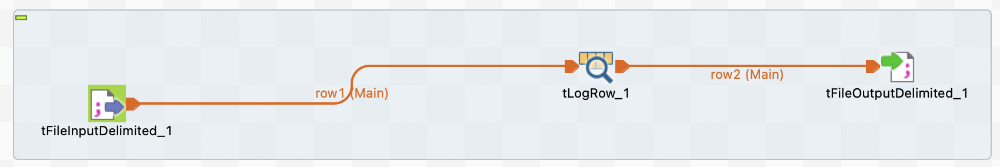

# Module 2: Working With Talend Open Studio DI

## Practical Document

### B. Adding Components In A Job

**STEPS:**

1. Create a new job and provide a relevant name.
2. Specify the purpose of creating the job
3. Provide the necessary information about the job.

   img
4. Select the path, where you want to store your job.
5. Click on ‘Finish’.
6. From the palette drag the components you need for the job and drop them into the workspace.

### C. Connecting The Components

**STEPS:**

### D. Reading A Delimited File

**STEPS:**

### E. Reading Delimited File Using Metadata

**STEPS:**

1. Go to the "Repository" window and expand the "Metadata" section
2. Right click on "File delimited"
3. (optional) I created a folder to contain metadata for module 2
4. Right click on folder under "File delimited"
5. Select "Create file delimited"

   

6. Specify the name for your delimited metadata as ‘Emp_Details’
7. Write the purpose as demo
8. In the description, provide the details
   
   

9. Click ‘Next’ to go to the next step
10. Browse the input file

    

11. Click ‘Next’ to go to the next step
12. Select the column separator as ‘|’
13. For ‘Escape Char Settings’, select ‘Delimited’
14. Checkmark the ‘Set heading row as column names’ to set the attributes

    

13. Select ‘Next’ to go the next step
14. Write ‘metadata’ as your file name
15. Click on ‘Finish’

   
   
   Then we will get new metadata as below

   

16. Create a job and add a tFileDelimitedInput and a tLogRow component in the workspace

    

17. Double-click on the tFileDelimitedInput component and go to its component tab
18. Select Property Type and schema as and from ‘Repository’

    

    

19. Click on ‘OK’
20. Go to the ‘Run’ tab and click on ‘Run’ to start the execution

    

### F. Writing In A Delimited File

**STEPS:**

1. From the palette drag the tFileOutputDelimited and drop in the previous job workspace.

    

2. Connect tLogRow and tFileOutputDelimited using ‘Row(Main)’ connection
3. Go to the component tab of the tFileOutputDelimited component and set the path, where you want to save your output file

    

4. Specify the Row Separator as ‘\n’
5. Specify the Field Separator as ‘;’
6. Go to the ‘Run’ tab to execute the job and generate the output file

    

    

### G. Reading A Positional File

**STEPS:**

1. Create a new job and add and tLogRow into the workspace

    

2. Link them using a ‘Row(main)’ link
3. Go to the component tab of component and specify the source path of your positional file
4. Specify the Row separator as ‘\n’ 

    

5. Now in the Pattern section, input "10,50,50,30,10,10"
6. Click on 'Edit schema' to set the schema of the positional file
7. Add the columns. Follow the following sequence to set the column name and its data type:
   - ID – integer
   - FName – String
   - LName - String
   - City - String
   - State - String
   - DOJ – Date

    

8. Click ‘OK’ to set the schema
9. Double-click on tLogRow component, go to its component tab and Select ‘Table’ as a mode, to print the data in the form of a structured table
10. Go to the Run tab and Click on ‘Run’ to read the positional file row by row

    

